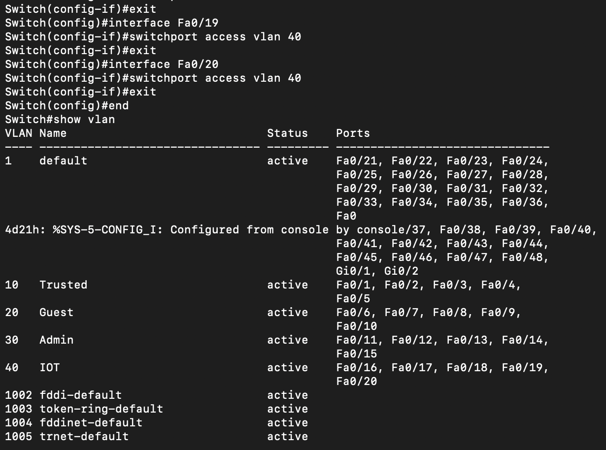

# Group 5

Labs:
Day | Time    
-| -| 
Thursday |  10:00 - 12:00
Friday | 10:00 - 12:00


Team Members
- Khairallah Ahmad Obay
- Napetvaridze Shota
- Palomares Estrella Hugo Edgar
- Rindebrant Wictor
- Shaban Ryustem


Linux server:
- IP: 10.0.0.250 <br> 
login creds:
- username: group5
- password: group5 

Windows server: 
- IP: 10.0.0.254 <br> 
login creds:
- username: group5.local
- password: Group5

Access Point (Cisco Aeronet 3502 series): 
- IP: 10.0.0.99 <br> 
login creds:
- username: Group5 Cisco
- password: SecretGroup5 

Access Point (UniFi U6-Pro): 
login creds:
- username: Group5
- password: SecretGroup5 


Firewall (Netgate SG-2100): 
login creds:
- username: admin
- password: group5 

<br>
<br>

# Assignment 1

The commands we used to reset to factory default settings before starting:

1. **Firewall (Cisco ASA 5510)**:
    - useful commands: # show running-config

   ```shell
    G5-ASA-5510> enable
    G5-ASA-5510# conf t
    G5-ASA-5510(config)# configure factory-default
    G5-ASA-5510(config)# wr mem
   ```

1. **Firewall (Netgate SG-2100)**:
    - We chose the 4th option to reset to default factory settings 
   

2. **Switch (Cisco Catalyst 3550 SERIES)**:

   ```shell
   Switch> en
   Switch# write erase 
   Switch# reload 
   ```

2. **Access Point (Cisco Aeronet 3502 series)**:

   ```shell
    ap> en
    ap# write erase
    ap# reload
   ```

## The configuration steps on Cisco ASA 5510
**Important Note**: Before proceeding, ensure that you have console access to the Cisco ASA 5510 through a console cable and terminal emulation software like PuTTY or a similar tool.

1. **Connect to the Cisco ASA 5510**:
   - Connect one end of the console cable to the console port on the ASA 5510.

2. **Enter privileged EXEC mode by typing**:

   ```shell
   ciscoasa> enable
   ```

   - Enter global configuration mode:

   ```shell
   ciscoasa# conf t
   ```

3. **Setting Hostname** (Optional):
   - You can set a hostname for the ASA if desired:

   ```shell
   ciscoasa(config)# hostname G5-ASA-5510
   G5-ASA-5510(config)# wr mem

   ```

   
Done
4. **Configuring Interfaces**:
   - Define the outside and inside interfaces.

   ```shell
   G5-ASA-5510(config)# int Ethernet0/0
   G5-ASA-5510(config)# nameif outside
   G5-ASA-5510(config)# ip address 192.168.0.50 255.255.255.0
   G5-ASA-5510(config)# security-level 0
   G5-ASA-5510(config)# no shut
   G5-ASA-5510(config)# int Ethernet0/1
   G5-ASA-5510(config)# nameif inside
   G5-ASA-5510(config)# ip address 10.0.0.1 255.255.255.0
   G5-ASA-5510(config)# security-level 100
   G5-ASA-5510(config)# no shut
   G5-ASA-5510(config)# wr mem
   ```

   - The above configuration says that Ethernet0/0 will be the interface for outside network and Ethernet0/1 is the interface for inside network.

5. **Configuring Routing(from inside to outside)**:

   ```shell
   G5-ASA-5510(config)# route outside 0 0 192.168.0.1
   ```


6. **Configuring DHCP & DNS inside**:
    - Address range of DHCP inside network: 10.0.0.100 - 10.0.0.200 
    - We binded DNS to OpenDNS servers (More Secure)
   ```shell
   G5-ASA-5510(config)# dhcpd address 10.0.0.100-10.0.0.200 inside
   G5-ASA-5510(config)# dhcpd dns 208.67.222.222 208.67.220.220
   G5-ASA-5510(config)# dhcpd lease 7200                          
   G5-ASA-5510(config)# dhcpd enable inside 
   G5-ASA-5510(config)# wr mem
   ```

7. **Configuring NAT**:
   - Configure basic NAT to allow inside devices to access the internet:

   ```shell
   G5-ASA-5510(config)# object network myNatPool
   G5-ASA-5510(config-network-object)# range 192.168.0.51 192.168.0.52
   G5-ASA-5510(config-network-object)# exit
   G5-ASA-5510(config)# object network myInsNet  
   G5-ASA-5510(config-network-object)# subnet 10.0.0.0 255.255.255.0  
   G5-ASA-5510(config-network-object)# nat (inside,outside) dynamic myNatPool
   G5-ASA-5510(config-network-object)# exit 
   
   G5-ASA-5510(config)# object network myLinServ
   G5-ASA-5510(config-network-object)# host 192.168.0.50  
   G5-ASA-5510(config-network-object)# nat (inside,outside) static 10.0.0.250
   G5-ASA-5510(config-network-object)# exit
   G5-ASA-5510(config)# same-security-traffic permit inter-interface
   G5-ASA-5510(config)# wr mem 

   ```

8. **Configuring Access Control List (ACL)**:

   ```shell

    G5-ASA-5510(config)# access-list allow_icmp_inside extended permit icmp 10.0.0.0 255.255.255.0 192.168.0.0 255.255.255.0
    G5-ASA-5510(config)# access-group allow_icmp_inside in interface inside
    G5-ASA-5510(config)# wr mem
   ```


## The configuration steps on Servers

1. **Configuring static IP for linux server**:
   - We have to edit "/etc/netplan/00-installer-config.yaml" file
   ```shell
   network:
      version: 2
      renderer: networkd
      ethernets:
         eth0:
            addresses:
               - 10.0.0.250/24
            routes:
               - to: default
                 via: 10.10.10.1
            nameservers:
               addresses: [208.67.222.222, 208.67.220.220]

   ```
   ```shell
   $ sudo netplan apply

   ```
2. **Configuring HTTP and FTP server on linux**:
   
   ```shell
   $ sudo apt install apache2
   $ sudo apt install vsftpd
   $ sudo ufw enable 
   $ sudo ufw allow 'Apache Full'
   $ sudo ufw allow 20,21,22,990/tcp
   $ sudo ufw allow 40000:50000/tcp
   $ systemctl status apache2
   ```
   - Also we edited /etc/vsftpd.conf file for FTP on the ubuntu server side. 
   - **Important Note**: We also allowed SSH traffic for our group's convenience.


3. **Configuring Active Directory on Windows Server**:

   1. Connect the ethernet cable to the laptop since promoting to Domain controller you need active connection
   2. Assign static ip from outside of the pool range to the server like 10.0.0.254.
    Control Panel --> Network and Internet --> Network and Sharing Center --> Change Adapter Settings which is on the left hand side --> Select the Ethernet and right click on Priorities --> Choose Internet Protocol version 4 --> choose properties and assign the required IP and gateway + the DNS also.check it with ipconfig.
   3. Now you can finish up promoting the server to domain controller
   4. On Internet Explorer go to Tools which is on the right top
   5. Choose Internet Options
   6. Go to security panel which is on top right of the new window
   7. Choose Custom Level
   8. Find Downloads
   9. File Download -- Enable
   10. Font Download  -- Enable
   11. Enable. NET framework -- Enable
   12. Find Scripting at the same page1
   13. Active Scripting -- Enable
   14. Allow programmatic clipboard access -- Promt
   15. Allow Status bar updates via script --Enable
   16. Scripting for Java applets -- Enable
   17. Go to search bar and find Windows Firewall (not with advanced security)
   19. on the right side choose Turn on windows firewall on or off
   20. Domain Network settings -- Notify me when Windows firewall blocks a new app ( Windows firewall turned on here)
   21. Private Network settings -- Notify me when Windows Firewall blocks a new app ( Windows firewall is on here)
   22. Public network settings -- Notify me when windows firewall blocks a new app ( Firewall is on here)
   23. Download Google Chrome
   24. Install Java 11
   25. Once downloaded get the Unifi software https://ui.com/download/releases/network-server try to get one of the older version 7.4.162.
   26. Open the unifi software

## The configuration steps on APs
**1. UniFi U6-Pro**
 - To configure UniFi U6-Pro AP we followed guide on my moodle, downloaded one older UniFi server. Allowed the server thorugh the windows firewall. Simple setup with wifi in the UniFi server UI.

**2. Access Point Cisco Aeronet 3502 series**
- To configure a Cisco Aironet access point using PuTTY, you'll need to connect to the access point via its command-line interface (CLI) over SSH or Telnet. Here are the steps to do this:

**Note**: Before proceeding, make sure you have PuTTY installed on your computer.

1. **Connect to the Access Point**:
   - Ensure your computer is connected to the same network as the Cisco Aironet access point.
   - Launch PuTTY.

2. **Open a New Session**:
   - In the PuTTY configuration window, enter the IP address or hostname of the access point in the "Host Name (or IP address)" field.
   - Choose the connection type:
     - For SSH, select "SSH."
     - For Telnet, select "Telnet."
   - Enter the port number (usually 22 for SSH or 23 for Telnet).

3. **Initiate the Connection**:
   - Click the "Open" button to initiate the connection.

4. **Login**:
   - Once the connection is established, you will be prompted to log in.
   - Enter the username and password for the access point. By default, the username and password are both "cisco" (without the quotes). If these credentials have been changed, use the updated login credentials.

5. **Access the Command-Line Interface (CLI)**:
   - After successfully logging in, you will have access to the command-line interface (CLI) of the Cisco Aironet access point.

6. **Configure the BVI1 Interface**:
   - To configure the BVI1 interface and assign an IP address and netmask, use the following commands:
   
   ```
   enable
   configure terminal
   interface BVI1
   ip address <IP_ADDRESS> <NETMASK>
   exit
   exit
   ```

   Replace `<IP_ADDRESS>` with the desired IP address (e.g., `192.168.1.2`) and `<NETMASK>` with the subnet mask (e.g., `255.255.255.0`).

7. **Save Configuration**:
   - To save your configuration, use the following command:
   
   ```
   write memory
   ```

   This command saves your changes to the device's configuration.

8. **Exit PuTTY**:
   - Type `exit` to log out of the access point's CLI, and then close the PuTTY session.

9. **Verify Configuration**:
   - You can verify the configuration by trying to access the access point's web GUI using the new IP address you configured for the BVI1 interface.

That's it! You have configured the Cisco Aironet access point's BVI1 interface using PuTTY. Be sure to follow best practices for securing your access point and changing default login credentials for improved security.

## Replacing Cisco ASA 5510 with Netgate SG-2100 Firewall


<br>
<br>

# Assignment 2
## 1. Using Cisco ASA 5510 firewall  
**Cisco Switch configuration for VLANs**
1. Switch enable
2. Switch# vlan d
3. Switch(vlan)# vlan 10 name Trusted
4. Switch(vlan)# end
5. Switch# conf t
6. Switch(config)# interface Fa0/1
7. Switch(config-if)# switchport mode access vlan 10
8. Switch(config-if)# end
--- FOR ALL THE 4 VLANS and 5 Ports assigned each ---
9. Switch# conf t
10. Switch(config)# interface Fa0/1 (We check on which port the switch is connected to the ASA 5510 in our case it was 0/1)
11. Switch(config-if)# switchport trunk encapsulation dot1q
12. Switch(config-if)# switchport mode trunk allowed vlan all

